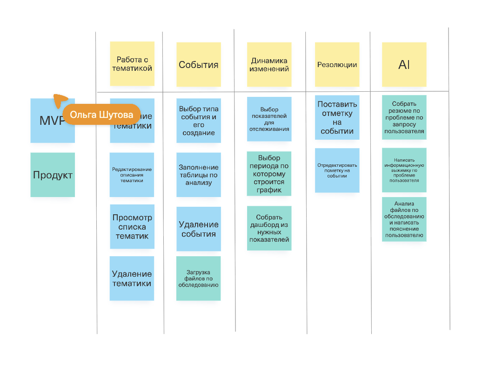

* Распознавание текста из фото или PDF (OCR) для извлечения ключевых показателей.

* Напоминания о необходимости сдать повторный анализ.

* Автоматическое уведомление при выходе показателя за пределы нормы (для интеграций с внешними системами и умными устройствами).

* Пользователь может фильтровать по резолюциям: 1 - помогло, 2 - не помогло

* Пользователь может фильтровать результаты по типам событий (всего 4) : анализы, консультация специалиста/назначение, исследования  и "другое".

* Пользователь может поделиться результатом(ами) события с резолюцией.

&nbsp;

https://unidraw.io/app/board/9a7a9506dcfb002c5407

{width=782px height=600px}