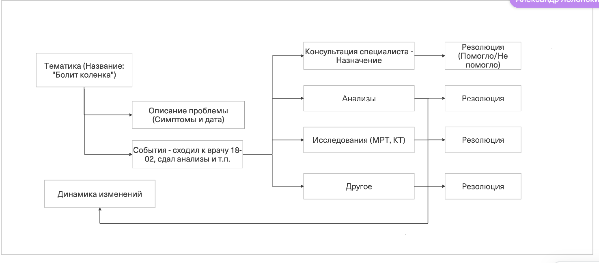

**Глоссарий** — это упорядоченный список специальных терминов с их толкованиями, принятыми в конкретной области знаний или проекте. По сути, это мини-словарь  для нашего проекта.

&nbsp;



---

* **Термин**

* **Пояснение**

* 

---

* **Событие**

* Действие/мероприятие, направленное на решение возникшей проблемы со здоровьем. Всего предполагается 4 типа событий : консультации, анализы, исследования, другое.

* 

---

* **Консультация специалиста**

* Тип событий со свободной формой заполнения для описания приемов у врачей.

* Например: 02.03.2026 был на приеме у пульмонолога, на приеме проводилось \[список манипуляций\], в результате приема, следующий назначения: \[список назначений\] и направления: \[список направлений\].

---

* **Направления**

* Рекомендация врача для консультации у врача другого профиля.

* Терапевт отправляет к ЛОРу, гастроэнтеролог к эндокринологу, невролог - к хирургу и т.д.

---

* **Назначения**

* Назначенный список манипуляций, направленных на стабилизацию состояния пациента. В данный перечень может входить консервативное лечение (прием лекарств), рекомендации по режиму дня, питания, физ. активности.

* На прием: \[лекарственные средства\] курсом Х дней в дозировке Y мг.
   Снизить физическую активность. Ограничить прием жирной пищи, соблюдать режим отдыха в ночное время.

---

* **Анализы**

* Тип события со строгой формой заполнения, по шаблону, с ручным вводом числовых значений

* 

---

* **Исследования**

* Тип события по диагностике  (без числовых значений) с возможностью загрузки изображения и текстового заключения

* МСКТ, МРТ,
   рентгенологическое исследование, ФГДС и прочее.

---

* **Другое**

* Иные события, которые по мнению пользователя, не подходит под 3 типа выше

* Например: физиолечение, иглорефлексотерапия, "кодирование" и прочее в вольной форме написания.

---

* **Тематика**

* Раздел, создаваемый пользователем для конкретного вопроса и внутри него структурирует информацию по "Описанию", "Событиям", "Динамика изменений"

* "летняя травма колена", "мои мигрени",  "подозрение на гастрит"

---

* **Резолюция**

* Субъективное решение пользователя о результате данного события в 2 вариантах

* Помогло/
   Не помогло

---

* **Динамика изменений**

* Перечень графиков по числовым значениям типа события "Анализы" в хронологическом порядке по датам проведения.

* 

---

* **Референсное значение**

* Диапазон значений, который считается нормальным для физиологических показателей у здоровых людей.

* Может измеряться в числовом значении (целые числа (10, 15, 20..), числа с плавающей точкой (10.5, 16.7 ..) и в процентном соотношении (43%, 67%..) .

---

* **Форма анализа**

* Экран или набор полей, который пользователь заполняет при добавлении нового анализа (зависит от типа анализа)

* 



&nbsp;

{width=1362px height=600px}